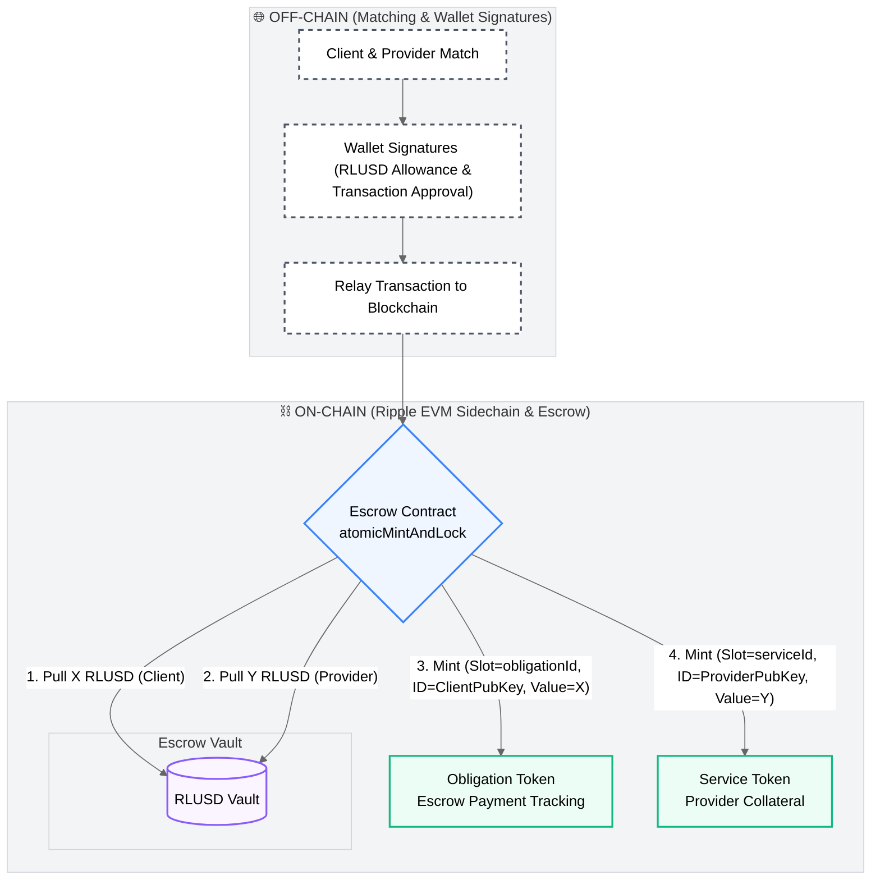
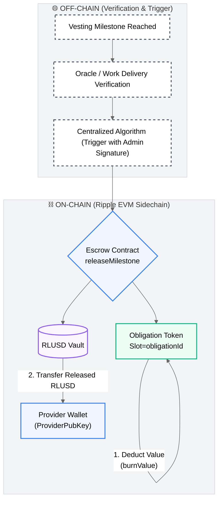
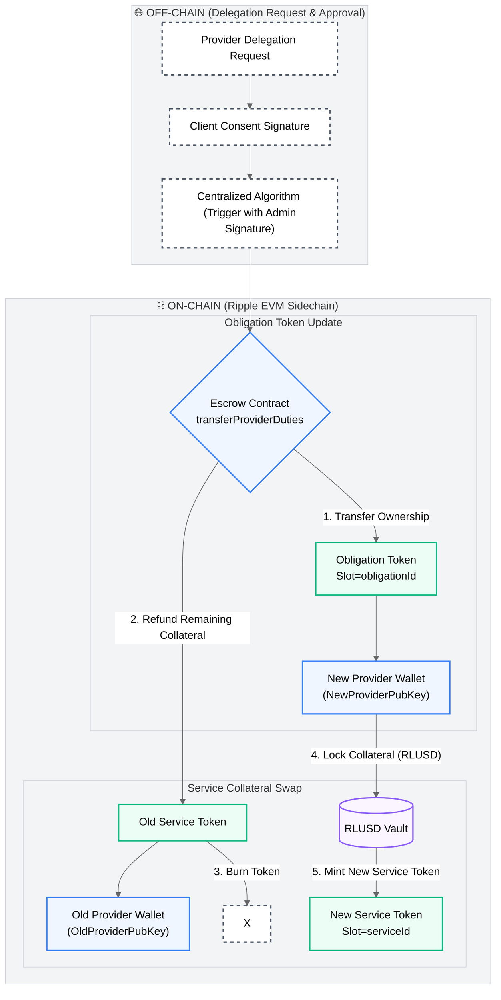
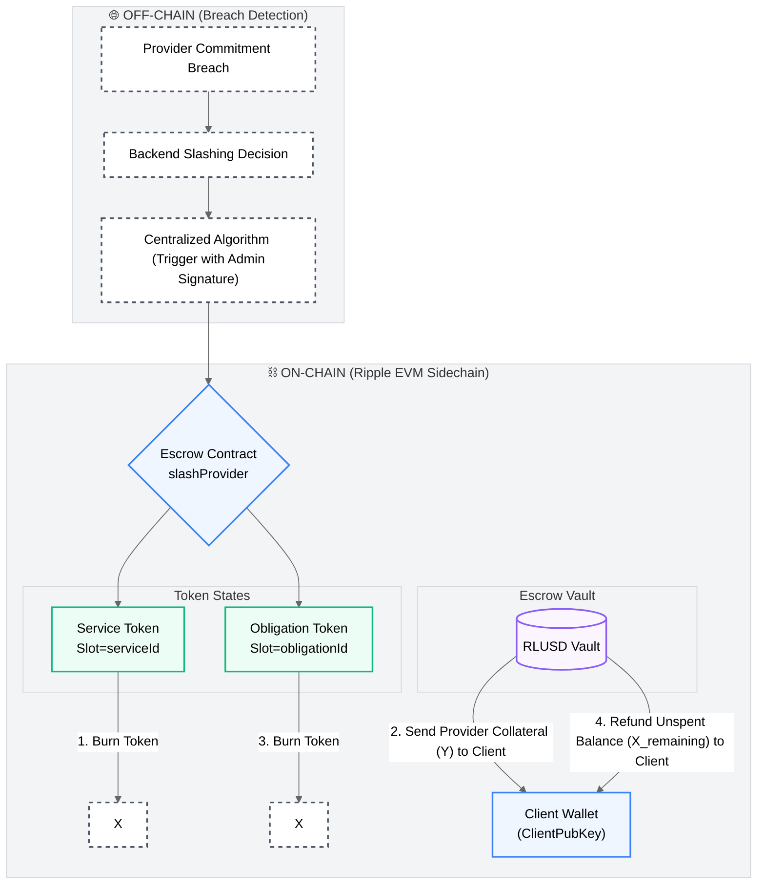

# Governed On-Chain Accounting and Escrow Layer Flow Diagrams

This document outlines the architecture and the 4 main operational flows of the **governed (custodial/governed) on-chain accounting and escrow layer** implemented on the **Ripple EVM Sidechain** using the **ERC-3525 Semi-Fungible Token** standard.

---

## Architectural Specifications & Token Design

To support fine-grained financial logic and deterministic escrow states, the token attributes of the ERC-3525 standard are mapped as follows:

### 1. ERC-3525 Slot (`uint256`) Structures

Slots classify tokens sharing the same business rule structure. In ERC-3525, tokens with the same slot are compatible for value transfers (`transferValue`), allowing splitting and merging of values.

#### A. Service Token Slot: `serviceId(type, startDate, endDate, defaultDate)`
Represents the provider's collateral parameters. Packed or hashed into a `uint256` value:
- **`type`** (e.g., `uint8`): The category/class of the service.
- **`startDate`** & **`endDate`** (e.g., `uint32`): The active duration of the service contract.
- **`defaultDate`** (e.g., `uint32`): The grace period or resolution deadline in case of delivery defaults.

#### B. Obligation Token Slot: `obligationId(serviceSlot, milestoneConfig, paymentType, penaltyRate)`
Represents the client's payment obligation and escrow rules. Packed or hashed into a `uint256` value:
- **`serviceSlot`** (e.g., `uint128`): Directly references the `serviceId` of the matching Service Token. This ensures that the payment obligation is cryptographically/deterministially tied to a specific service structure.
- **`milestoneConfig`** (e.g., `uint64`): Encodes milestone counts, interval durations, or vesting epoch configurations (e.g., 4 equal monthly hakediş releases).
- **`paymentType`** (e.g., `uint8`): Defines the release logic (e.g., `0` for Time-Fragmented / Vesting, `1` for Oracle-Triggered, `2` for Hybrid).
- **`penaltyRate`** (e.g., `uint56`): Specifies the slashing multiplier (e.g., percentage of provider collateral to be forfeited to the client in case of SLA breach).

---

### 2. ERC-3525 Token ID (`uint256`)

Represents the identity of the token owner. Since the ERC-3525 `tokenId` is a `uint256` value, it stores the **Owner's Public Key** (or its Ethereum address derivation, which fits comfortably within the 256-bit unsigned integer limits).
- **Service Token ID:** `ProviderPubKey`
- **Obligation Token ID:** `ProviderPubKey` (When representing the right to receive payment) or `ClientPubKey` (Depending on custody/escrow claims, or transferred to the provider upon duty delegation/claim initialization).

---

### 3. ERC-3525 Value

Directly represents the exact locked **RLUSD (Ripple USD)** amount. Financial operations like value transfer (`transferValue`) or value burning (`burnValue`) trigger the underlying ERC-20 RLUSD transfers between client/provider wallets and the escrow pool.

---

### 4. Gated Off-Chain Orchestration

Direct wallet-to-wallet transfers via standard ERC-3525 methods are blocked. All business logic rules (vesting schedules, matching, market fragmentation) are computed off-chain, and validated state updates are pushed to the chain using the **Centralized Algorithm (signed by the Admin Key)**.

---

## 1. Job Initialization (Atomic Mint & Lock)

When a match is established off-chain, the Client and the Provider sign the transaction/allowance with their crypto wallets. The escrow contract executes the atomic lock of RLUSD and mints the corresponding ERC-3525 tokens. No manual admin approval is required.

---

## 2. Time-Fragmented Consumption (Milestone Release)

As milestones/vesting periods elapse and off-chain oracle verifications are submitted, the Centralized Algorithm (with Admin signature) triggers the release function. The value in the Obligation Token is reduced and paid to the provider.

---

## 3. Market/Time-Fragmented Duty Delegation (Transfer / Replacement)

When a service provider delegates/transfers their duties to a new provider, the **Client's signature is required**. The Centralized Algorithm updates the escrow state: the old provider's Service Token is burned and collateral returned, a new Service Token is minted for the new provider, and the Obligation Token is transferred to the new provider.

---

## 4. Slashing (Collateral Forfeiture)

If the provider violates their service commitments, the off-chain system detects the breach. The Centralized Algorithm (with Admin signature) triggers the slash function: the Provider's Service Token is burned and their locked collateral is sent to the Client. The Client's remaining unspent balance in the Obligation Token is refunded.

