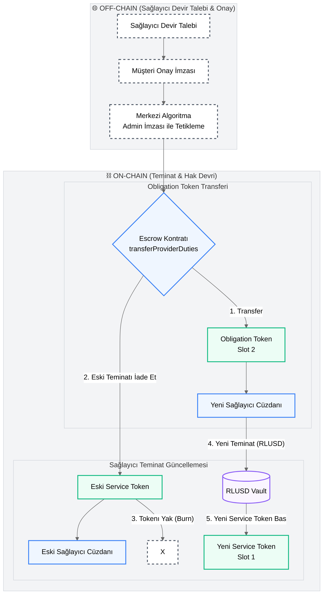

# Gözetimli On-Chain Muhasebe ve Escrow Katmanı Akış Diyagramları (Revize)

Bu doküman, kullanıcı geri bildirimleri doğrultusunda güncellenmiş akış diyagramlarını içermektedir.

Yapılan güncellemeler:
1. **İş Başlangıcı:** Manuel admin onayı kaldırıldı. Eşleşme sağlandığında kullanıcıların kripto cüzdan imzaları ile doğrudan escrow kilitlemesi ve token basımı (mint) tetiklenir.
2. **Merkezi Algoritma:** On-chain tetiklemeler için "Admin" ifadesi yerine, işlemleri admin imzasıyla otomatik yürüten **"Merkezi Algoritma (Admin İmzası ile)"** tanımı kullanıldı.
3. **Sağlayıcı Devri (Transfer):** Devir işlemi müşteri tarafından değil, **Hizmet Sağlayıcı** tarafından başlatılır. **Müşterinin de imzası alınarak**, eski sağlayıcının Service Token'ı yakılıp teminatı iade edilir, yeni sağlayıcı adına yeni Service Token basılır ve hak edilecek tutarı temsil eden Obligation Token yeni sağlayıcıya transfer edilir.

---

## 1. İş Başlangıcı (Atomic Mint & Lock)

Eşleşme sağlandığında admin onayına gerek kalmaksızın, Müşteri ve Sağlayıcının kripto cüzdanlarıyla attığı imzalar doğrudan akıllı sözleşme üzerindeki kilitleme ve token basım sürecini başlatır.

```mermaid
%%{init: {'theme': 'neutral', 'themeVariables': { 'primaryColor': '#f9fafb', 'edgeLabelBackground':'#ffffff', 'clusterBkg':'#f3f4f6', 'clusterBorder':'#d1d5db'}}}%%
graph TD
    %% Sınıf Tanımları
    classDef offChainNode fill:#ffffff,stroke:#4b5563,stroke-width:2px,stroke-dasharray: 5 5;
    classDef onChainNode fill:#eff6ff,stroke:#3b82f6,stroke-width:2px;
    classDef tokenNode fill:#ecfdf5,stroke:#10b981,stroke-width:2px;
    classDef databaseNode fill:#faf5ff,stroke:#8b5cf6,stroke-width:2px;

    subgraph OffChain ["🌐 OFF-CHAIN (Eşleşme & Cüzdan İmzaları)"]
        A[Müşteri & Sağlayıcı Eşleşmesi]:::offChainNode --> B[Müşteri & Sağlayıcı Cüzdan İmzaları <br> (RLUSD Harcama & İşlem Onayı)]:::offChainNode
        B --> C[İşlem Verisinin Zincire İletilmesi]:::offChainNode
    end

    subgraph OnChain ["⛓️ ON-CHAIN (Escrow & Token Motoru)"]
        C --> D{Escrow Kontratı <br> atomicMintAndLock}:::onChainNode
        
        subgraph Vault ["Escrow Havuzu"]
            Pool[(RLUSD Vault)]:::databaseNode
        end
        
        D -- "1. X RLUSD Çek (Müşteri)" --> Pool
        D -- "2. Y RLUSD Çek (Sağlayıcı)" --> Pool
        
        D -- "3. Mint (Slot 2, Value=X)" --> OT[Obligation Token <br> Sağlayıcıya Hak Ediş Göstergesi]:::tokenNode
        D -- "4. Mint (Slot 1, Value=Y)" --> ST[Service Token <br> Sağlayıcı Cüzdanı]:::tokenNode
    end
```

---

## 2. Time Fragmented Tüketim (Hakediş)

Belirlenen zaman dilimleri dolduğunda ve oracle doğrulaması yapıldığında, merkezi algoritma admin imzasıyla hakediş fonksiyonunu tetikler.

```mermaid
%%{init: {'theme': 'neutral', 'themeVariables': { 'primaryColor': '#f9fafb', 'edgeLabelBackground':'#ffffff', 'clusterBkg':'#f3f4f6', 'clusterBorder':'#d1d5db'}}}%%
graph TD
    classDef offChainNode fill:#ffffff,stroke:#4b5563,stroke-width:2px,stroke-dasharray: 5 5;
    classDef onChainNode fill:#eff6ff,stroke:#3b82f6,stroke-width:2px;
    classDef tokenNode fill:#ecfdf5,stroke:#10b981,stroke-width:2px;
    classDef databaseNode fill:#faf5ff,stroke:#8b5cf6,stroke-width:2px;

    subgraph OffChain ["🌐 OFF-CHAIN (Doğrulama & Tetikleme)"]
        A[Hakediş Dönemi Sonu]:::offChainNode --> B[Oracle / İş Teslim Doğrulaması]:::offChainNode
        B --> C[Merkezi Algoritma <br> (Admin İmzası ile Tetikleme)]:::offChainNode
    end

    subgraph OnChain ["⛓️ ON-CHAIN (Değer Transferi)"]
        C --> D{Escrow Kontratı <br> releaseMilestone}:::onChainNode
        
        D --> OT[Obligation Token <br> Slot 2]:::tokenNode
        OT -- "1. Değer Düşürülür <br> burnValue" --> OT
        
        D --> Pool[(RLUSD Vault)]:::databaseNode
        Pool -- "2. Hakedilen RLUSD'yi Gönder" --> Prov[Sağlayıcı Cüzdanı]:::onChainNode
    end
```

---

## 3. Market/Time Fragmented Devir (Transfer)

Hizmet sağlayıcı iş bitmeden devir yapmak istediğinde, **Müşteri'nin de imzasıyla** devir süreci başlatılır. Eski sağlayıcının teminatı iade edilirken, yeni sağlayıcıdan teminat alınarak yeni Service Token basılır ve Obligation Token yeni sağlayıcıya transfer edilir.



---

## 4. Slashing (Ceza)

Sağlayıcı taahhüdünü ihlal ettiğinde, merkezi algoritma admin imzasıyla slashing fonksiyonunu çağırarak sağlayıcının teminatını müşteriye aktarır ve müşterinin kalan parasını iade eder.

```mermaid
%%{init: {'theme': 'neutral', 'themeVariables': { 'primaryColor': '#f9fafb', 'edgeLabelBackground':'#ffffff', 'clusterBkg':'#f3f4f6', 'clusterBorder':'#d1d5db'}}}%%
graph TD
    classDef offChainNode fill:#ffffff,stroke:#4b5563,stroke-width:2px,stroke-dasharray: 5 5;
    classDef onChainNode fill:#eff6ff,stroke:#3b82f6,stroke-width:2px;
    classDef tokenNode fill:#ecfdf5,stroke:#10b981,stroke-width:2px;
    classDef databaseNode fill:#faf5ff,stroke:#8b5cf6,stroke-width:2px;

    subgraph OffChain ["🌐 OFF-CHAIN (İhlal Tespiti)"]
        Breach[Sağlayıcı Taahhüt İhlali]:::offChainNode --> Decision[Backend Slashing Kararı]:::offChainNode
        Decision --> AlgTrig[Merkezi Algoritma <br> (Admin İmzası ile Tetikleme)]:::offChainNode
    end

    subgraph OnChain ["⛓️ ON-CHAIN (Cezalandırma & İade)"]
        AlgTrig --> SlashCall{Escrow Kontratı <br> slashProvider}:::onChainNode
        
        subgraph VaultState ["Escrow Havuzu"]
            Pool[(RLUSD Vault)]:::databaseNode
        end

        subgraph TokenState ["Token Durumları"]
            ST[Service Token <br> Slot 1]:::tokenNode
            OT[Obligation Token <br> Slot 2]:::tokenNode
        end

        SlashCall --> ST
        SlashCall --> OT

        %% Sağlayıcı Teminatı Tazminatı
        ST -- "1. Yak (Burn)" --> BurnST[X]:::offChainNode
        Pool -- "2. Sağlayıcı Teminatını (Y) Tazminat Olarak Gönder" --> Cust[Müşteri Cüzdanı]:::onChainNode

        %% Müşteri Bakiyesi İadesi
        OT -- "3. Yak (Burn)" --> BurnOT[X]:::offChainNode
        Pool -- "4. Harcanmamış Bakiyeyi (X_kalan) İade Et" --> Cust
    end
```